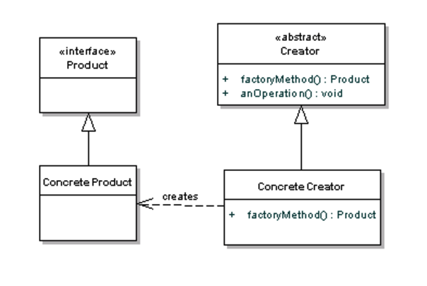

## Factory Method - Implementación de referencia

Modelo de referencia [DZONE](https://dzone.com/articles/design-patterns-factory):



La siguiente, es la implementación de una aplicación de tipo Terminal. Esta terminal -más allá de interpretar comandos- tiene como requisito el permitir ajustar el contenido presentado al inicio de la aplicación (Welcome Tip). 


Para compilar

```bash
mvn compile
```

Para ejecutar la aplicación:

```bash
mvn exec:java  -Dexec.mainClass=test.Main
```

Para cambiar la configuración de la aplicación: Modificar el método getFactoryInstance() de la clase WelcomeTipFactory.

